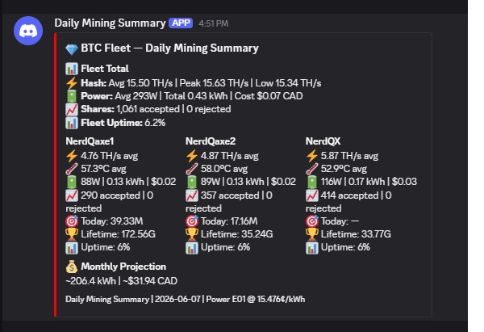

# daily_btc_fleet_summary.sh

Generates a daily Discord summary of your BTC mining fleet by parsing the log from `btc_fleet_monitor.sh`. Runs nightly via cron and sends a single embed covering the previous 24 hours — fleet totals, per-miner stats with session-aware "today's best" diff, and monthly projection.

Requires `btc_fleet_monitor.sh` to be running on cron and writing to its log file.

---

## How It Works

At 00:02 daily (via cron), the script:

1. Greps the previous day's `STATUS` lines from `btc_fleet_monitor.log`
2. For each miner, extracts hashrate, temp, power, shares accepted/rejected, best session diff
3. Detects miner restarts (when `Accepted` counter drops between polls) and accumulates share deltas across sessions
4. Determines whether each miner's current session **started today** (for accurate "Today's Best" calculation)
5. Calculates power consumption (kWh) and CAD cost from actual watt readings
6. Sums fleet totals
7. Projects monthly energy/cost from the day's data
8. Sends a color-coded Discord embed:
   - 🟢 **Green** — clean day, all miners ≥90% uptime, no rejected shares
   - 🟠 **Orange** — any rejected shares
   - 🔴 **Red** — any miner uptime < 90%

### Why No Pool Context Section?

BTC miners on this stack point to Ocean via DATUM Gateway (not a GSS pool), so there's no `/api/v1/{coin}/metrics/pool` endpoint to query. The Avalon Q and DGB Nerd/Nano summaries include Pool Context because they hit GSS-hosted pools; this one intentionally doesn't.

---

## Configuration

Edit the variables at the top of the script:

```bash
LOG_FILE="/home/ubuntu/btc_fleet_monitor.log"
WEBHOOK_FILE="/home/ubuntu/Discord_Webhook_Summary.txt"
POWER_RATE=0.15476       # $/kWh
POLL_INTERVAL=5          # Must match btc_fleet_monitor.sh cron interval
EXPECTED_POLLS=288       # 24h * 60min / POLL_INTERVAL

# Display names — must match column 3 of STATUS lines exactly
MINERS=("NerdQaxe1" "NerdQaxe2" "NerdQX")
```

The `MINERS` array entries must match the display names in column 3 of `btc_fleet_monitor.log`'s `STATUS` lines — same names you defined in the poller's `MINERS` array.

Uses the shared `~/Discord_Webhook_Summary.txt` so summaries from all 3 daily scripts post to the same channel.

---

## Install

```bash
# Copy script to your monitoring server
cp daily_btc_fleet_summary.sh /home/ubuntu/
chmod +x /home/ubuntu/daily_btc_fleet_summary.sh

# Edit MINERS array to match your fleet
nano /home/ubuntu/daily_btc_fleet_summary.sh

# Dry run for today (no Discord post)
/home/ubuntu/daily_btc_fleet_summary.sh --today --dry-run

# Live test for today
/home/ubuntu/daily_btc_fleet_summary.sh --today

# Add to cron — 00:02 staggered so Avalon Q's 00:01 finishes first
crontab -e
```

Add this line:

```
2 0 * * * /home/ubuntu/daily_btc_fleet_summary.sh
```

### Requirements

- `curl` — Discord webhook POSTs
- `jq` — JSON construction (also required by `btc_fleet_monitor.sh`)
- `grep` with `-P` (Perl regex) — log parsing
- `awk` — stats computation
- `btc_fleet_monitor.sh` actively logging to `btc_fleet_monitor.log`

```bash
sudo apt install curl jq
```

---

## Command Line Options

| Flag | Effect |
|------|--------|
| `--dry-run` | Print summary to terminal, don't send to Discord |
| `--date YYYY-MM-DD` | Generate for a specific date (default: yesterday) |
| `--today` | Generate for today (partial day) |
| `--help` | Show usage |

```bash
# Normal: yesterday, sent to Discord
./daily_btc_fleet_summary.sh

# Test today's data without sending
./daily_btc_fleet_summary.sh --today --dry-run

# Generate for a specific past date
./daily_btc_fleet_summary.sh --date 2026-06-05
```

---

## Example Discord Embed



> The screenshot above shows the embed with a **red left border** because `btc_fleet_monitor.sh` only started running ~3 hours into the target day — Fleet Uptime came in at 6.2%, which triggers the red color logic. A full-day clean run would show green.

Embed structure:

| Field | Layout | Contents |
|-------|--------|----------|
| 📊 **Fleet Total** | Full width | Combined hashrate (avg/peak/low), total kWh, cost, total shares, fleet uptime % |
| Per-miner blocks | 3 inline columns | One column per miner with avg hash, temp, power, shares, today/lifetime best, uptime |
| 💰 **Monthly Projection** | Full width | 30-day kWh + cost extrapolation |

Each per-miner column shows:

```
⚡ X.XX TH/s avg
🌡️ XX.X°C avg
🔋 XXW | X.XX kWh | $X.XX
📈 XXX accepted | 0 rejected
🎯 Today: XX.XXM   ← session-aware best diff (see below)
🏆 Lifetime: XX.XXG ← all-time best from bestDiff field
📊 Uptime: XX%
```

---

## What the Stats Mean

**Per-miner avg hashrate** — Computed from the `Hash:` field in every poll for that miner, in GH/s in the log, converted to TH/s in the embed.

**24h share delta with restart detection** — AxeOS reports `sharesAccepted` as a cumulative session counter that resets to zero when the miner reboots. A naive last-minus-first subtraction would undercount whenever a miner restarted. Instead, the script walks the day's readings in time order, detects every drop in the counter (= restart), and sums the deltas across all sessions to give a true 24-hour share count.

**Power kWh** — Calculated from actual AxeOS `power` watt readings: `Σ(watts × 5 / 60) / 1000`. This is real measured PSU power, not nameplate estimation.

**🏆 Lifetime Best** — `bestDiff` from AxeOS. The all-time best share submitted by the miner since first install. Formatted with `T/G/M/K` suffixes.

**🎯 Today's Best (session-aware)** — Maximum `bestSessionDiff` for the miner _during the target day_. This is more complex than it sounds because `bestSessionDiff` only resets on miner reboot, not at midnight. See the dedicated section below.

**Fleet Uptime** — `(sum of valid polls across all miners) / (288 × number of miners) × 100`. A miner returning `UNREACHABLE` or `INVALID_JSON` counts against uptime.

**Monthly Projection** — Extrapolates the day's energy use to a full month: `(daily kWh / valid polls × expected polls) × 30`. Partial days scale up.

---

## Session-Aware "Today's Best" Logic

This is the trickiest part of the script. The problem: `bestSessionDiff` in AxeOS is the best share since the miner last booted, not the best share today.

Three scenarios:

| Scenario | What "Today's Best" should be |
|----------|-------------------------------|
| Miner was running before midnight, no reboots today | Best diff while the value INCREASED today |
| Miner rebooted today (session start ≥ today midnight) | Full session's `bestSessionDiff` |
| Miner rebooted multiple times today | Max of all reset segments today |

The script handles this by:

1. Reading the first poll of the target day, extracting `Uptime:` (seconds since boot)
2. Computing `session_start_epoch = first_poll_timestamp - uptime_seconds`
3. If `session_start_epoch ≥ target_midnight`, the current session started today → its `bestSessionDiff` is fully eligible
4. If not, only deltas where the session counter INCREASED today are eligible
5. On any counter reset (`Accepted` drops between polls), close the current segment and start fresh

Without this logic, a miner that had a great share yesterday and hasn't beat it today would falsely show that share as "Today's Best." The dash (`—`) shows up when no new best was set today.

---

## Color Logic

| Color | Trigger |
|-------|---------|
| 🟢 Green (`3066993`) | All miners ≥ 90% uptime, no rejected shares |
| 🟠 Orange (`16744448`) | Any miner has rejected shares for the day |
| 🔴 Red (`16711680`) | Any miner < 90% uptime |

Red takes precedence over orange. A day with both rejected shares and downtime shows red.

---

## Troubleshooting

**Embed shows zeros for a miner:** Check if `btc_fleet_monitor.sh` was running for that day:

```bash
grep "MinerName" /home/ubuntu/btc_fleet_monitor.log | grep "$(date -d 'yesterday' +%Y-%m-%d)" | head
```

If this comes back empty, the poller wasn't running.

**Embed shows "Offline all day":** All `STATUS` lines for that miner on the target date were `UNREACHABLE` or `INVALID_JSON`. The poller reached the IP but got nothing usable back. Check network, miner power, or AxeOS firmware health.

**Share delta seems wrong after a miner restart:** Verify with:

```bash
grep "MinerName" log | grep -oP 'Accepted:\K[0-9]+'
```

Look for the counter dropping — those are restart points. The script handles them, but if the miner restarted multiple times rapidly, double-check that consecutive lines show consecutive drops.

**"Today's Best" shows `—` unexpectedly:** This means the script saw no `bestSessionDiff` improvement during the target day. If the miner went 24 hours without finding a higher share than it had at the start of the day, this is correct behavior. If you expected a new best, check that the miner was running (uptime % > 0%) and that `bestSessionDiff` values in the log actually increased during the day.

**jq error:** Install with `sudo apt install -y jq`. Both this script and `btc_fleet_monitor.sh` require it.

---

## Related Scripts

- **`btc_fleet_monitor.sh`** — The poller that writes `btc_fleet_monitor.log`. Must be running on `*/5 * * * *` cron.
- **`daily_mining_summary.sh`** — Avalon Q daily summary. Fires at `1 0 * * *`.
- **`daily_dgb_summary.sh`** — DGB Nerd/Nano daily summary. Fires at `3 0 * * *`.

The three daily summaries are staggered (`1 0`, `2 0`, `3 0`) so all log rotations at `0 0` finish first and the embeds arrive in Discord in a predictable order.
