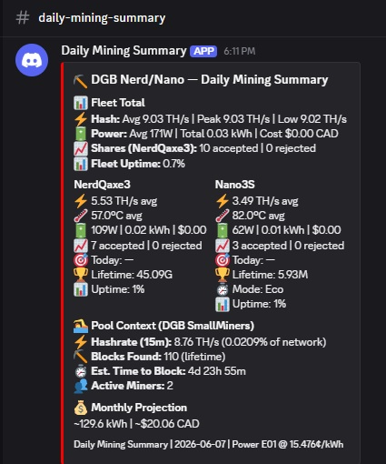

# daily_dgb_summary.sh

Generates a daily Discord summary of your DGB SmallMiners pool fleet (NerdQaxe3 + Nano 3S in the reference setup) by parsing the log from `dgb_miners_monitor.sh`. Runs nightly via cron and sends a single embed covering the previous 24 hours — fleet totals, per-miner stats with type-aware display, live pool context from [GSS by MMFP Solutions](https://mmfpsolutions.com/), and monthly projection.

Requires `dgb_miners_monitor.sh` to be running on cron, and GSS running locally with the pool API exposed.

---

## How It Works

At 00:03 daily (via cron), the script:

1. Greps the previous day's `STATUS` lines from `dgb_miners_monitor.log`
2. For each miner, extracts hashrate, temp, power, shares, and best diff
3. For Canaan miners, also extracts current work mode
4. Detects miner restarts and accumulates share deltas across sessions (AxeOS only — Canaan doesn't expose session boundaries)
5. Calculates power consumption (kWh) and CAD cost from actual watt readings
6. Sums fleet totals
7. Pulls **pool context** from the GSS API (`/api/v1/DGB/metrics/pool` — the SmallMiners pool)
8. Projects monthly energy/cost from the day's data
9. Sends a color-coded Discord embed:
   - 🟢 **Green** — clean day, all miners ≥90% uptime, no rejected shares
   - 🟠 **Orange** — any rejected shares
   - 🔴 **Red** — any miner uptime < 90%

### Type-Aware Display

Both AxeOS and Canaan miners use the same embed layout, but with two important differences:

| Field | AxeOS (NerdQaxe3) | Canaan (Nano 3S) |
|-------|-------------------|------------------|
| 🎯 **Today's Best** | Session-aware logic (see `DAILY_BTC_FLEET_SUMMARY.md`) | Always `—` — CGMiner exposes only one lifetime counter, no session split |
| 🏆 **Lifetime Best** | From `bestDiff` field (lifetime miner counter) | From `Best Share` field in CGMiner `summary` command |
| ⏱️ **Mode** | Not shown | Shown — current work mode (`Eco`/`Standard`/`Super`) |

The script reads the miner type from the `Type:` field in each log line and branches the display logic accordingly.

---

## Configuration

Edit the variables at the top of the script:

```bash
LOG_FILE="/home/ubuntu/dgb_miners_monitor.log"
WEBHOOK_FILE="/home/ubuntu/Discord_Webhook_Summary.txt"
POWER_RATE=0.15476       # $/kWh
POLL_INTERVAL=5
EXPECTED_POLLS=288

# Miner definitions — "DisplayName:Type" — names must match column 3 of STATUS lines
MINERS=("NerdQaxe3:axeos" "Nano3S:canaan")

# GSS API endpoint for the DGB SmallMiners pool
GSS_API_POOL="http://127.0.0.1:4004/api/v1/DGB/metrics/pool"
```

Each entry in `MINERS` is `DisplayName:Type` where type is `axeos` or `canaan`. The display name must match what's in column 3 of the poller's `STATUS` lines.

Uses the shared `~/Discord_Webhook_Summary.txt` so all 3 daily summaries post to the same channel.

---

## Install

```bash
# Copy script to your monitoring server
cp daily_dgb_summary.sh /home/ubuntu/
chmod +x /home/ubuntu/daily_dgb_summary.sh

# Edit MINERS array
nano /home/ubuntu/daily_dgb_summary.sh

# Dry run for today (no Discord post)
/home/ubuntu/daily_dgb_summary.sh --today --dry-run

# Live test for today
/home/ubuntu/daily_dgb_summary.sh --today

# Add to cron — 00:03, staggered after Avalon Q (00:01) and BTC Fleet (00:02)
crontab -e
```

Add this line:

```
3 0 * * * /home/ubuntu/daily_dgb_summary.sh
```

### Requirements

- `curl` — Discord webhooks + GSS API
- `jq` — JSON for both Discord embed construction and GSS pool data
- `grep` with `-P` (Perl regex) — log parsing
- `awk` — stats computation
- `dgb_miners_monitor.sh` actively logging
- GSS running locally with API accessible

```bash
sudo apt install curl jq
```

---

## ⏰ Timing & Timezone

### Default behavior

The script fires at the time you set in cron and reports the **previous calendar day** in `America/Regina` time (UTC-6, no DST).

Default cron entry:

```
3 0 * * * /home/ubuntu/daily_dgb_summary.sh
```

This fires at **00:03 in the host's system time**, not `America/Regina` time.

### Host timezone matters

The script does **not** inherit the host system's timezone for date math. It forces `TZ='America/Regina'` internally so the "yesterday" window is always anchored to `America/Regina` calendar days.

Cron itself, however, fires on **host system time**. Three common scenarios:

| Host TZ | `3 0 * * *` fires at | Report you receive |
|---|---|---|
| `UTC` | 00:03 UTC = 18:03 `America/Regina` (prev day) | "Yesterday in `America/Regina`" delivered ~6 PM local |
| `America/Regina` | 00:03 `America/Regina` | "Yesterday in `America/Regina`" delivered ~midnight |
| Anywhere else | Whatever 00:03 means on that host | Same report content, different delivery time |

The reference deployment runs on a **UTC** host. That means reports arrive at ~6 PM `America/Regina` time. This is intentional — no midnight alerts, and a UTC host keeps published scripts portable.

### Customizing for your setup

**Change report timezone** (anchor reports to *your* local calendar day):

Edit the script and replace the line:

```bash
TZ='America/Regina'
```

with your own TZ identifier, e.g.:

```bash
TZ='Europe/London'
TZ='America/New_York'
TZ='Asia/Tokyo'
```

`tzselect` on Linux lists valid options.

> ⚠️ **Important:** the corresponding poller script must use the **same TZ** as this daily summary. The script filters its log by date string, and both writer and reader must agree on what date a given log line belongs to. If you change `TZ` here, also change it in [`dgb_miners_monitor.sh`](DGB_MINERS_MONITOR.md). Mismatched TZs will silently produce reports with missing or double-counted hours at day boundaries.

**Change delivery time:** Adjust the cron schedule. Two examples:

```
# 8 AM delivery on a UTC host, where you want 8 AM in UTC-5 local
0 13 * * * /home/ubuntu/daily_dgb_summary.sh

# 11 PM delivery on a host already set to your local TZ
0 23 * * * /home/ubuntu/daily_dgb_summary.sh
```

**Verify cron timing without waiting:** run with `--today` to generate a partial report for the current day, or `--date YYYY-MM-DD` to regenerate any past day's report on demand.

### Why ~18-hour data lag is acceptable

With a UTC host and a 00:03 UTC cron, reports arrive ~18 hours after the day they cover ends.

This is fine for a hobbyist monitoring stack:

- **Real-time alerting** is handled by [GSS/GSSM](https://mmfpsolutions.com/), AxeOS, and the realtime monitor scripts in this repo (`avalon_temp_monitor.sh`, `monitor_btc_stack.sh`). They alert immediately on actual incidents.
- **Daily summaries** are for trend visibility — hashrate drift, thermal behavior, share patterns, uptime trends. None of that is time-sensitive enough to need live-as-of-fire-time data.

If you want fresher data, see [Rolling 24h Patch](#rolling-24h-patch) below.

---

## Rolling 24h Patch

The default model is **calendar-day**: each report covers a fixed midnight-to-midnight window in the report timezone. This was chosen deliberately:

- **Honest gap handling** — if the monitor was down for 4 hours, that gap is anchored to a specific calendar day. With rolling windows, the same gap silently shrinks every report it appears in.
- **Reproducible** — `--date 2026-06-07` regenerates an identical report. Rolling windows have no equivalent reproducibility.
- **Clearer mental model** — "yesterday's mining day" is easier to reason about than "the past 24 hours from whenever the script fired."

If you still want rolling 24h, the change is small. `EXPECTED_POLLS` stays at 288 (24h × 60min / 5min interval), so uptime % math is unchanged.

### Find this block

```bash
# --- Parse arguments ---
DRY_RUN=false
TARGET_DATE=$(date -d "yesterday" +%Y-%m-%d)

# ... argument parsing ...

# --- Extract lines for target date ---
STATUS_LINES=$(grep "^${TARGET_DATE}" "$LOG_FILE" | grep "| STATUS |")
ALL_LINES=$(grep "^${TARGET_DATE}" "$LOG_FILE")
```

### Replace with

```bash
# --- Parse arguments ---
DRY_RUN=false

while [[ $# -gt 0 ]]; do
    case "$1" in
        --dry-run) DRY_RUN=true; shift ;;
        -h|--help)
            echo "Usage: $0 [--dry-run]"
            echo "  Reports rolling 24-hour window ending at script fire time."
            exit 0
            ;;
        *) echo "Unknown option: $1"; exit 1 ;;
    esac
done

# --- Compute rolling 24h window ---
END_TS=$(date +%s)
START_TS=$((END_TS - 86400))
START_DT=$(date -d "@$START_TS" '+%Y-%m-%d %H:%M:%S')
END_DT=$(date -d "@$END_TS"     '+%Y-%m-%d %H:%M:%S')

# YYYY-MM-DD HH:MM:SS sorts lexicographically, so string compare works
STATUS_LINES=$(awk -v s="$START_DT" -v e="$END_DT" '
    {
        ts = $1 " " $2
        if (ts >= s && ts <= e) print
    }
' "$LOG_FILE" | grep "| STATUS |")

ALL_LINES=$(awk -v s="$START_DT" -v e="$END_DT" '
    {
        ts = $1 " " $2
        if (ts >= s && ts <= e) print
    }
' "$LOG_FILE")
```

### Also update the footer

Find the Discord payload near the bottom of the script. Replace:

```bash
footer: { text: ("Daily Mining Summary | " + $date + " | Power E01 @ 15.476¢/kWh") }
```

with:

```bash
footer: { text: ("Rolling 24h | ending " + $end_dt + " | Power E01 @ 15.476¢/kWh") }
```

You'll also need to pass `END_DT` into the `jq` payload as a variable (`--arg end_dt "$END_DT"`) alongside the existing `$date` arg. In the "No Data" branch, replace any `${TARGET_DATE}` reference with text describing the rolling window — e.g., `"No mining data found in the last 24 hours."`

### Trade-offs

| Aspect | Calendar-day (default) | Rolling 24h (this patch) |
|---|---|---|
| Data freshness | ~18hr lag from end-of-day | Fresh through fire time |
| Reproducibility | `--date YYYY-MM-DD` works | No equivalent — depends on fire time |
| Gap attribution | Anchored to specific calendar day | Smears across multiple reports |
| `--today` / `--date` flags | Useful | Become meaningless — can be removed |
| Window boundaries | Stable midnight-to-midnight | Slightly different each report |

Run with `--dry-run` after applying the patch to verify output before letting cron take over.

---

## Command Line Options

| Flag | Effect |
|------|--------|
| `--dry-run` | Print summary to terminal, don't send to Discord |
| `--date YYYY-MM-DD` | Generate for a specific date (default: yesterday) |
| `--today` | Generate for today (partial day) |
| `--help` | Show usage |

```bash
# Normal: yesterday, sent to Discord
./daily_dgb_summary.sh

# Test today's data without sending
./daily_dgb_summary.sh --today --dry-run

# Generate for a specific past date
./daily_dgb_summary.sh --date 2026-06-05
```

---

## Example Discord Embed



> The screenshot above shows the embed with a **red left border** because the DGB poller had only been running for a few minutes when this summary fired — uptime came in low. A full-day clean run would show green.

Embed structure:

| Field | Layout | Contents |
|-------|--------|----------|
| 📊 **Fleet Total** | Full width | Combined hashrate (avg/peak/low), total kWh, cost, total shares (from AxeOS only), fleet uptime % |
| Per-miner blocks | 2 inline columns | NerdQaxe3 + Nano 3S side by side |
| 🏊 **Pool Context (DGB SmallMiners)** | Full width | Live GSS API stats for the pool |
| 💰 **Monthly Projection** | Full width | 30-day kWh + cost extrapolation |

Per-miner column layout (both types use the same shape):

```
⚡ X.XX TH/s avg
🌡️ XX.X°C avg
🔋 XXW | X.XX kWh | $X.XX
📈 XXX accepted | 0 rejected
🎯 Today: XX.XXM   (axeos) or — (canaan, always)
🏆 Lifetime: XX.XXG
⏱️ Mode: Eco       (canaan only)
📊 Uptime: XX%
```

---

## Pool Context Section

The script makes one HTTP call to `http://127.0.0.1:4004/api/v1/DGB/metrics/pool` and extracts:

| Field | API path | Display |
|-------|----------|---------|
| Pool hashrate (15-min avg) | `.hashrate."15m"` | TH/s + % of network |
| Network share | `.network_comparison.pool_percentage` | percentage |
| Estimated time to block | `.network_comparison.estimated_time_to_block` | human-readable |
| Lifetime blocks found | `.blocks_found` | count |
| Active miners | `.active_miners` | count |

If the API call fails, the section shows `❌ Pool data unavailable` and everything else still renders. The script never aborts on pool context failure.

To target a different GSS pool, change `GSS_API_POOL` to point to its endpoint. For example, change `/api/v1/DGB/metrics/pool` to `/api/v1/DGB-BIGMINERS/metrics/pool` to target the BigMiners pool instead.

---

## What the Stats Mean

**Per-miner avg hashrate** — Computed from the `Hash:` field in every poll. GH/s in the log, converted to TH/s in the embed.

**Share counters (AxeOS)** — Restart-aware delta as described in `DAILY_BTC_FLEET_SUMMARY.md`. AxeOS `sharesAccepted` is session-cumulative; the script sums deltas across reboots.

**Share counters (Canaan)** — From the CGMiner `summary` command. Same restart-aware delta logic applies, but Canaan miners typically have longer uptimes so resets are rarer.

**🎯 Today's Best** — Always `—` for Canaan miners. CGMiner exposes only one lifetime `Best Share` value with no session boundaries, so there's no way to compute "best share submitted today" from CGMiner data. The AxeOS column uses the same session-aware logic described in the BTC Fleet doc.

**🏆 Lifetime Best** — For AxeOS, the `bestDiff` field (all-time miner counter). For Canaan, the `Best Share` field from CGMiner `summary` — also lifetime, just labeled differently.

**⏱️ Mode (Canaan only)** — Current work mode at the last poll of the target day. Useful for spotting whether the miner spent time in Eco vs Standard, though Canaan miners typically don't auto-switch the way the Avalon Q does.

**Fleet Uptime** — `(sum of valid polls across all miners) / (288 × number of miners) × 100`.

**Monthly Projection** — Extrapolates the day's energy use to 30 days, scaling up partial days.

---

## Color Logic

| Color | Trigger |
|-------|---------|
| 🟢 Green (`3066993`) | All miners ≥ 90% uptime, no rejected shares |
| 🟠 Orange (`16744448`) | Any miner has rejected shares for the day |
| 🔴 Red (`16711680`) | Any miner < 90% uptime |

Red takes precedence over orange.

---

## Troubleshooting

**Pool Context shows "Pool data unavailable":** GSS API isn't responding. Check:

```bash
curl -s http://127.0.0.1:4004/api/v1/DGB/metrics/pool | jq .
```

If this errors, GSS is down or the API endpoint changed. The rest of the embed will still render correctly.

**Canaan miner showing zeros for shares:** The `summary` command failed but `stats` succeeded — check the poller log. Older CGMiner builds (pre-4.x) may not support `summary`.

**Nano 3S "Today" always shows `—`:** That's correct behavior. CGMiner doesn't expose session-level best diff on Canaan devices, only a single lifetime counter. There's no way to compute "today's best" from CGMiner data.

**`Mode:` line missing on Canaan column:** The poller didn't capture a `Mode:` field. Check `dgb_miners_monitor.log` for the relevant `STATUS` lines — the `Mode:` field should appear for `Type:canaan` entries.

**jq error:** Install with `sudo apt install -y jq`.

---

## Related Scripts

- **`dgb_miners_monitor.sh`** — The poller that writes `dgb_miners_monitor.log`. Must be running on `*/5 * * * *` cron.
- **`daily_mining_summary.sh`** — Avalon Q daily summary. Fires at `1 0 * * *`.
- **`daily_btc_fleet_summary.sh`** — BTC fleet daily summary. Fires at `2 0 * * *`.

This script fires at `3 0 * * *` so it's the last of the three daily summaries to arrive each night.
