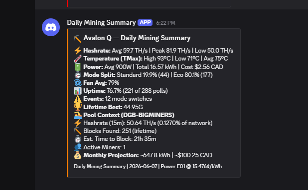
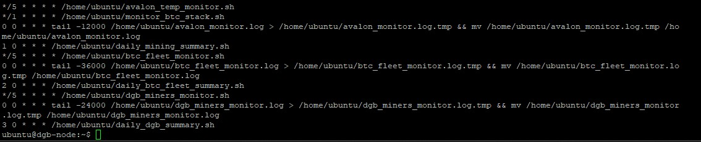

# crypto-mining-tools

Monitoring, alerting, and daily summary scripts for ASIC miners and mining infrastructure. CGMiner API, AxeOS API, Start9/DATUM Gateway, [GSS pool API](https://mmfpsolutions.com/), Discord webhooks.

I built these to run my own home mining stack on autopilot. Every script runs on cron, tracks state to avoid alert spam, and pushes structured Discord output when things change or once a day. Same cron + bash + Discord webhook pattern I use for my [DigiDollar oracle monitoring](https://github.com/BaumerCrypto/digidollar-oracle-tools).



---

## The Stack

Three layers, each with a clear job:

| Layer | Scripts | When | What it does |
|-------|---------|------|--------------|
| **Real-time alerts** | `avalon_temp_monitor.sh`, `monitor_btc_stack.sh` | Every 1–5 min | Fires Discord alerts on state changes — overheating, dead fans, crashed miner, stratum offline. Tracks state to prevent spam. |
| **Data collection** | `btc_fleet_monitor.sh`, `dgb_miners_monitor.sh` | Every 5 min | Polls miners, writes structured `STATUS` lines to log files. No alerting — GSSM handles real-time miner alerts. |
| **Daily summaries** | `daily_mining_summary.sh`, `daily_btc_fleet_summary.sh`, `daily_dgb_summary.sh` | Nightly at 00:01 / 00:02 / 00:03 | Parses the log files, computes daily totals, sends one Discord embed per fleet. |

Log files are trimmed nightly by separate `tail`-based cron jobs so they don't grow unbounded.

### Cron schedule



In text:

```
# Real-time monitoring
*/5 * * * * /home/ubuntu/avalon_temp_monitor.sh
*/1 * * * * /home/ubuntu/monitor_btc_stack.sh

# Fleet pollers (data collection only)
*/5 * * * * /home/ubuntu/btc_fleet_monitor.sh
*/5 * * * * /home/ubuntu/dgb_miners_monitor.sh

# Log rotations (midnight, trim to retention)
0 0 * * * tail -12000 /home/ubuntu/avalon_monitor.log > ...
0 0 * * * tail -36000 /home/ubuntu/btc_fleet_monitor.log > ...
0 0 * * * tail -24000 /home/ubuntu/dgb_miners_monitor.log > ...

# Daily summary embeds (staggered after log rotations finish)
1 0 * * * /home/ubuntu/daily_mining_summary.sh        # Avalon Q       ⛏️
2 0 * * * /home/ubuntu/daily_btc_fleet_summary.sh     # BTC Fleet      💎
3 0 * * * /home/ubuntu/daily_dgb_summary.sh           # DGB Nerd/Nano  ⛏️
```

The daily summary scripts are staggered (`1 0`, `2 0`, `3 0`) so all log rotations at `0 0` finish first and the embeds arrive in Discord in a predictable order.

---

## ⏰ A Note on Timing

The three daily summary scripts handle timezone in a specific way that affects **when** they fire and **what** they report:

- **Report content** is anchored to `America/Regina` (UTC-6, no DST) via a hardcoded `TZ='America/Regina'` inside each script. The matching pollers (`avalon_temp_monitor.sh`, `btc_fleet_monitor.sh`, `dgb_miners_monitor.sh`) use the same TZ so log timestamps and date-filter math agree.
- **Cron firing time** uses your host's system timezone.

The reference deployment runs on a **UTC** host with cron entries `1 0 * * *`, `2 0 * * *`, `3 0 * * *`, which fire at 00:01–03 UTC — that's 18:01–03 evening in `America/Regina`. Reports therefore arrive in the evening with the previous day's data. This is intentional: UTC keeps the scripts portable across hosts, and the evening delivery avoids midnight alerting.

To change the report timezone for your own deployment, edit the `TZ='America/Regina'` line in each daily summary script **and** its matching poller. To change the delivery time, adjust the cron schedule. Full details and a rolling 24-hour-window alternative are documented in each per-script doc.

---

## Tools

| Script | Docs | What It Does | Cron |
|--------|------|--------------|------|
| `avalon_temp_monitor.sh` | [`AVALON_TEMP_MONITOR.md`](AVALON_TEMP_MONITOR.md) | Canaan Avalon Q ASIC — temps, fan health, hashboard errors, crash detection. Auto-switches work modes to protect hardware. Works with any CGMiner-compatible ASIC. | `*/5` |
| `monitor_btc_stack.sh` | [`MONITOR_BTC_STACK.md`](MONITOR_BTC_STACK.md) | Start9 OS + DATUM Gateway — ping check and stratum protocol probe. Catches DATUM outages that a simple TCP check would miss. | `*/1` |
| `btc_fleet_monitor.sh` | [`BTC_FLEET_MONITOR.md`](BTC_FLEET_MONITOR.md) | Polls BTC fleet of AxeOS miners (NerdQAxe family) every 5 min. No alerting — feeds `daily_btc_fleet_summary.sh`. | `*/5` |
| `dgb_miners_monitor.sh` | [`DGB_MINERS_MONITOR.md`](DGB_MINERS_MONITOR.md) | Polls DGB miner fleet — handles both AxeOS (NerdQAxe) and Canaan CGMiner (Avalon Nano/Q) miners. Dual-path API. | `*/5` |
| `daily_mining_summary.sh` | [`DAILY_MINING_SUMMARY.md`](DAILY_MINING_SUMMARY.md) | Avalon Q daily Discord embed — hashrate, temps, power, cost, mode split, uptime, lifetime best, pool context, monthly projection. | `1 0` |
| `daily_btc_fleet_summary.sh` | [`DAILY_BTC_FLEET_SUMMARY.md`](DAILY_BTC_FLEET_SUMMARY.md) | BTC fleet daily Discord embed — per-miner stats with restart-aware share counting and session-aware "today's best" diff. | `2 0` |
| `daily_dgb_summary.sh` | [`DAILY_DGB_SUMMARY.md`](DAILY_DGB_SUMMARY.md) | DGB Nerd/Nano daily Discord embed — type-aware display for AxeOS + Canaan miners, plus live GSS pool context. | `3 0` |

Each tool has its own documentation page with installation, configuration, log format, troubleshooting, and adapting-for-other-hardware notes.

---

## Requirements

All scripts run on a Linux box on the same LAN as your mining hardware. They don't run on the miners themselves. The reference setup is a small Ubuntu mini PC (`dgb-node`) that also runs the DGB full node and the [GSS pool engine by MMFP Solutions](https://mmfpsolutions.com/) — but any always-on Linux box will do.

**System packages:**

```bash
# Covers all 7 scripts:
#   curl       — Discord webhooks + HTTP API calls
#   jq         — JSON parsing (AxeOS, GSS API, Discord embed construction)
#   socat      — CGMiner API on TCP 4028 (avalon_temp_monitor + dgb_miners_monitor canaan path)
#   netcat     — stratum probe (monitor_btc_stack)
sudo apt install curl jq socat netcat-openbsd
```

`grep`, `awk`, `ping`, and `tail` are assumed present (they are on any standard Linux install).

---

## Discord Webhook Setup

The alert scripts (`avalon_temp_monitor.sh`, `monitor_btc_stack.sh`) read their webhook URL from a shared file. The three daily summary scripts use a **separate webhook file** so summaries go to their own channel and don't get mixed in with real-time alerts.

**1. Create Discord webhooks:**

Go to your Discord server → channel settings → Integrations → Webhooks → New Webhook. Copy the URL.

**2. Save to files on your monitoring server:**

```bash
# Alerts channel (shared by avalon_temp_monitor.sh and monitor_btc_stack.sh)
echo "https://discord.com/api/webhooks/YOUR_ALERTS_ID/YOUR_ALERTS_TOKEN" > ~/Discord_Webhook.txt
chmod 600 ~/Discord_Webhook.txt

# Daily summaries channel (shared by all 3 daily_*_summary.sh scripts)
echo "https://discord.com/api/webhooks/YOUR_SUMMARY_ID/YOUR_SUMMARY_TOKEN" > ~/Discord_Webhook_Summary.txt
chmod 600 ~/Discord_Webhook_Summary.txt
```

**3. Test them:**

```bash
curl -s -H "Content-Type: application/json" \
  -d '{"content":"Test from mining monitor"}' \
  "$(cat ~/Discord_Webhook.txt)"
```

You should see the message appear in your Discord channel.

> **Note:** Scripts default to reading from `/home/ubuntu/Discord_Webhook.txt` and `/home/ubuntu/Discord_Webhook_Summary.txt`. If your username isn't `ubuntu`, update the `WEBHOOK_FILE` paths at the top of each script.

---

## Related

- [`digidollar-oracle-tools`](https://github.com/BaumerCrypto/digidollar-oracle-tools) — My DigiDollar oracle monitoring, hardening guides, and deployment tools. Same design pattern (cron + bash + Discord) applied to oracle node operations.
- [GSS/GSSM by MMFP Solutions](https://mmfpsolutions.com/) — Solo mining pool software and miner manager I run for DGB and BTC. The pool context sections in the daily summary scripts query its API.
- [DATUM Gateway](https://github.com/OCEAN-xyz/datum_gateway) — Stratum proxy between Bitcoin Knots and miners on Start9. `monitor_btc_stack.sh` probes its stratum port to verify it's actually serving work.

---

## License

MIT — see [LICENSE](LICENSE).
